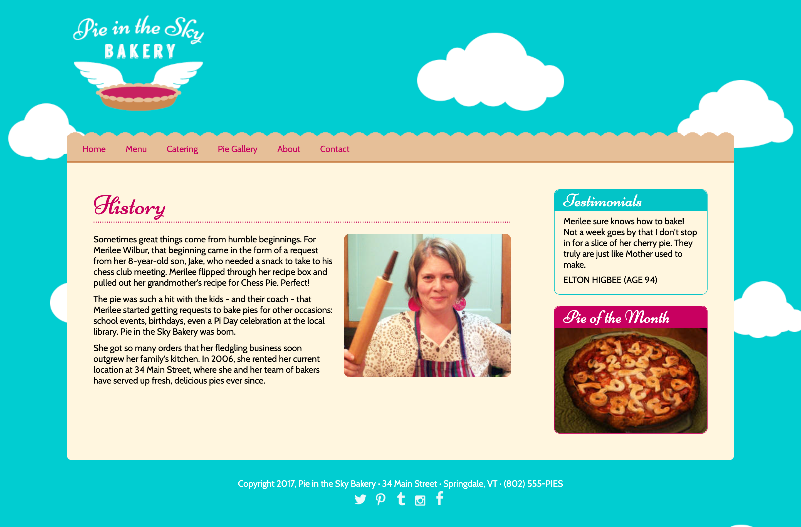

# CSS Flexbox Example

This project demonstrates the use of CSS Flexbox, inspired by Jen Kramer’s course on Front End Master. It showcases how Flexbox can be used to create responsive and flexible layouts in web design.

## Features

- Responsive design utilizing CSS Flexbox
- Clean and modern layout
- Efficient alignment and distribution of space among items in a container

## Visual Design

Below is a visual representation of the webpage design:



## Getting Started

To view the website locally, follow these steps:

1. **Clone the repository or download the files.**

```bash
git clone https://github.com/BhoomiGohil/Flexbox-Bakery-Demo.git
cd Flexbox-Bakery-Demo
```

2. **Open the `index.html` file in your web browser.**

```bash
open index.html
```

OR

Using Live Server in Visual Studio Code:

1. **Install the Live Server extension:**

Open Visual Studio Code
Go to the Extensions view by clicking on the square icon on the left sidebar or pressing Ctrl+Shift+X
Search for "Live Server" and click Install

2. Once installed, right-click on index.html and select "Open with Live Server".

This will open the project in your browser, and changes made to the code will be reflected automatically.

## Technologies Used

- HTML5
- CSS3 (Flexbox)

## Acknowledgments

- Special thanks to Jen Kramer for the insightful course that inspired this project.
